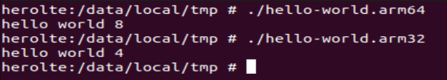

# Compile Set

1. ~/.bashrc에 추가
```
vim ~/.bashrc
```


```
# Android NDK
ANDROID_NDK_ROOT=/home/hoho/Android/Sdk/ndk/25.1.8937393
ANDROID_TOOLCHAIN=$ANDROID_NDK_ROOT/toolchains/llvm/prebuilt/linux-x86_64/bin

function compile_android() {
    local arch=$1
    local compiler=$2
    
    for file in *.c
    do
        filename="${file%.*}"
        case $arch in
            x86_64)
                $compiler $file -o $filename.x86_64
                ;;
            arm64)
                $compiler -target aarch64-linux-android23 $file -o $filename.arm64
                ;;
            arm32)
                $compiler -target armv7a-linux-androideabi23 $file -o $filename.arm32
                ;;
        esac
    done
}
```

```
alias android-x86_64-cc="compile_android x86_64 gcc"
alias android-arm64-cc="compile_android arm64 $ANDROID_TOOLCHAIN/clang"
alias android-arm32-cc="compile_android arm32 $ANDROID_TOOLCHAIN/clang"
```

> cpp 코드는 compile_android()에서 cpp를 다룰 수 있도록 변경하면 된다. 


## 실행 방법
```
android-arm64-cc
android-arm32-cc
android-x86_64-cc
```

## 안드로이드에서 실행하기
```
termux-elf-cleaner --api-level 25 ./hello-world.arm64

adb push ./hello-world.arm64 /data/local/tmp

adb shell /data/local/tmp/hello-world.arm64
```


