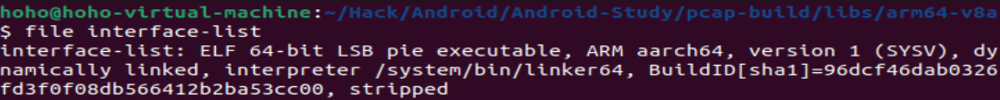

# libpcap-build

## how to build?

ndk가 제공하는 툴 중 하나인 ndk-build 를 사용하였음.

1. 소스코드 다운.

```
git clone https://android.googlesource.com/platform/external/libpcap
```

2. jni 폴더를 만들고, 하위 폴더 구성
폴더 구성은 다음과 같음.

```
tree ./ -L 2
./
├── jni
│   ├── Android.mk
│   ├── Application.mk
│   ├── interface-list.c
│   └── libpcap
└── README.md
```

이때 `Android.mk`는 libpcap에 있는 `Android.bp` 를 참고하였음.

3. jni상위 폴더에서 ndk-build 스크립트 실행
```
ndk-build
```

4. 실행 결과는 다음과 같음.

```
[armeabi-v7a] Compile thumb  : interface-list <= interface-list.c
[armeabi-v7a] Compile thumb  : p <= pcap-linux.c
[armeabi-v7a] Compile thumb  : p <= pcap-usb-linux.c
[armeabi-v7a] Compile thumb  : p <= fad-gifc.c
[armeabi-v7a] Compile thumb  : p <= pcap.c
[armeabi-v7a] Compile thumb  : p <= pcap-netfilter-linux-android.c
[armeabi-v7a] Compile thumb  : p <= bpf_filter.c
[armeabi-v7a] Compile thumb  : p <= gencode.c
[armeabi-v7a] Compile thumb  : p <= optimize.c
[armeabi-v7a] Compile thumb  : p <= nametoaddr.c
[armeabi-v7a] Compile thumb  : p <= etherent.c
[armeabi-v7a] Compile thumb  : p <= fmtutils.c
[armeabi-v7a] Compile thumb  : p <= savefile.c
[armeabi-v7a] Compile thumb  : p <= sf-pcap.c
[armeabi-v7a] Compile thumb  : p <= sf-pcapng.c
[armeabi-v7a] Compile thumb  : p <= pcap-common.c
[armeabi-v7a] Compile thumb  : p <= bpf_image.c
[armeabi-v7a] Compile thumb  : p <= bpf_dump.c
[armeabi-v7a] Compile thumb  : p <= scanner.c
[armeabi-v7a] Compile thumb  : p <= grammar.c
[armeabi-v7a] Compile thumb  : p <= strlcpy.c
[armeabi-v7a] StaticLibrary  : libp.a
[armeabi-v7a] Executable     : interface-list
[armeabi-v7a] Install        : interface-list => libs/armeabi-v7a/interface-list
[arm64-v8a] Compile        : interface-list <= interface-list.c
[arm64-v8a] Compile        : p <= pcap-linux.c
[arm64-v8a] Compile        : p <= pcap-usb-linux.c
[arm64-v8a] Compile        : p <= fad-gifc.c
[arm64-v8a] Compile        : p <= pcap.c
[arm64-v8a] Compile        : p <= pcap-netfilter-linux-android.c
[arm64-v8a] Compile        : p <= bpf_filter.c
[arm64-v8a] Compile        : p <= gencode.c
[arm64-v8a] Compile        : p <= optimize.c
[arm64-v8a] Compile        : p <= nametoaddr.c
[arm64-v8a] Compile        : p <= etherent.c
[arm64-v8a] Compile        : p <= fmtutils.c
[arm64-v8a] Compile        : p <= savefile.c
[arm64-v8a] Compile        : p <= sf-pcap.c
[arm64-v8a] Compile        : p <= sf-pcapng.c
[arm64-v8a] Compile        : p <= pcap-common.c
[arm64-v8a] Compile        : p <= bpf_image.c
[arm64-v8a] Compile        : p <= bpf_dump.c
[arm64-v8a] Compile        : p <= scanner.c
[arm64-v8a] Compile        : p <= grammar.c
[arm64-v8a] Compile        : p <= strlcpy.c
[arm64-v8a] StaticLibrary  : libp.a
[arm64-v8a] Executable     : interface-list
[arm64-v8a] Install        : interface-list => libs/arm64-v8a/interface-list
```

